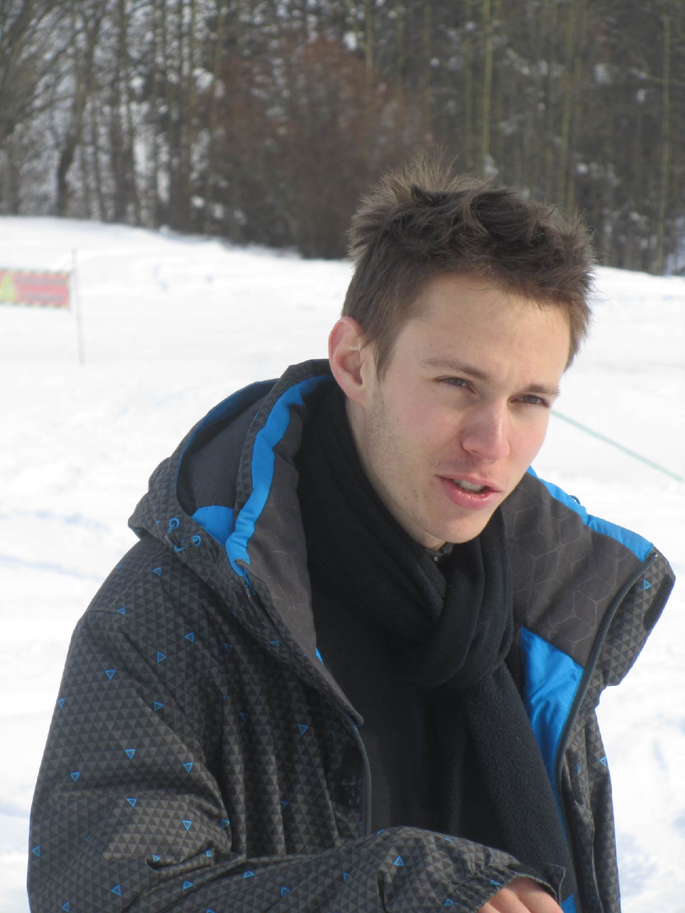

```{js}
$("#rStudioHeader").removeClass("alwaysShrunk");
$("#pageContent").removeClass("standardPadding");
```


<!--html_preserve-->

<div id="homeContent">
  <div class="band full blue first rightText">
    <div class="bandContent vCenter">
      <div class="blurb">
        <div class="tagline">Hi I'm Kevin Caye.</div>
        <div>PhD Student, Université Grenoble Alpes.</div>
      </div>
    </div>
  </div>

  <div class="band full gray1 second leftText">
    <div class="bandContent vCenter">
      <div class=row">

        <div class="col-md-6">
        <p>
            I am a Ph.D. student in the fields of statistics and genetics. I develop models and algorithms to help biologists analyse their data. I especially work on methods used to find genes associated with environmental pressures.
        </p>
        <p>
            My Ph.D. is supervised by Olivier François (TIMC-IMAG), Olivier Michel (GIPSA-lab) and Jean-Luc Bosson (TIMC-IMAG). My Ph.D. is supported by the LabEx PERSYVAL-Lab.
        </p>
        <p>
            I am a technology enthusiast, I am particularly interested in domotic and data science. But when I am not on my computer I do sport. My favorite sports are kyokushinkai karate and trail running but I like practicing every mountain sport.
        </p>
        </div>

        <div class="col-md-6">
          
        </div>

      </div>
    </div>
  </div>
<!--/html_preserve-->
